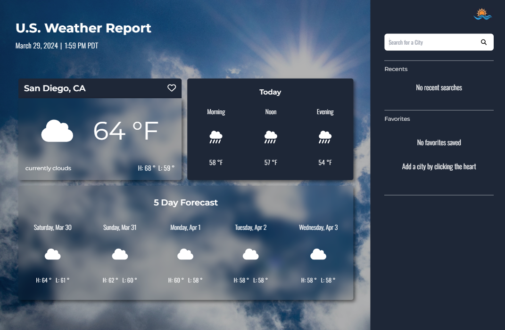

# U.S. Weather Report Rebuild &ensp;
**Name:** Elizabeth Trotter

**Project Description:** 

The primary objective of this project was to rebuild my former weather application with `Next.js`, `TypeScript`, and `TailwindCSS`. This project constituted the third sprint of the timeline outlined below.

- Data retrieval was accomplished through the `OpenWeatherAPI`. Extensive data manipulation was necessary via helper functions to align with the specifications outlined in the prototype design. There were many challenges to overcome as it was the first major project in which I leveraged `Next.js`.

## Timeline

| Sprint | Description | Tools |
| --- | --- | --- |
| Week 1 | 1. Design a desktop weather application using available data on [OpenWeatherAPI](https://openweathermap.org/api)   2. Flowchart the logic | `Figma`, `draw.io` | 
| Week 2 | Develop the application based on the prototype designed | `vanilla JavaScript`, `HTML`, `CSS`, `Bootstrap` |
| Week 3 | Rebuild the application with Next.js | `Next.js`, `TypeScript`, `TailwindCSS` |

Table 1: Revised project timeline updated March 29, 2024 to include Rebuild Sprint

> [!NOTE]
> You can find the original **vanilla JavaScript version** of this project by clicking [**here**](https://github.com/et120/weatherapplication) :point_left:

---

## Desktop Preview

Figure 1: Snapshot of rebuilt U.S. Weather Report

> ### Peer Review:
> 
> **Name:** Michael Heckerman | **Date/ Time:** 3/29/2024 10:46am
> 
> **Comment(s):** Downloaded the code to make sure it worked, it did. Tested the site on desktop where it worked fine. When I tested it on my phone it didn't fit properly, but it did function as intended other than the sizing issues.

**Issue(s) Resolved**:
- [x] Responsiveness for mobile fix 3/29/24 1:44pm

---

## See nextjs-setup.md for the download + install
- Project will need api key
